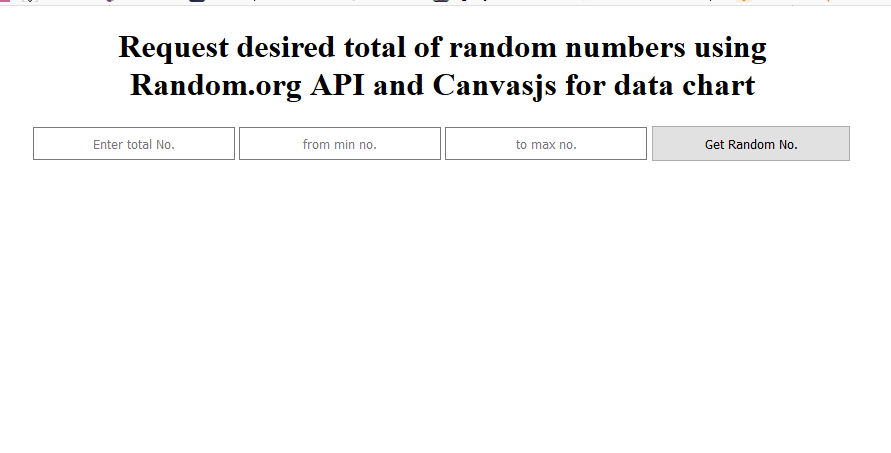
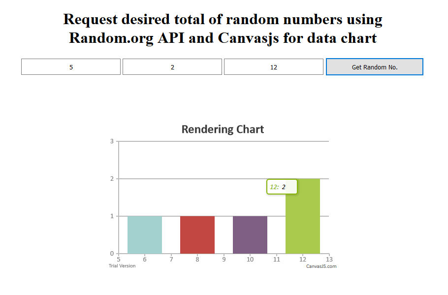

# jQuery-AJAX-POST-
Using Random.org API for generating random numbers from desired range (min and max) and drawing chart using canvasjs.

  

The application is consisted from several input fields, where you can enter the range of total numbers, from min value to max value. By clicking the "Get Random No." button, request to Random.org API will be sent and as soon we receive the response from server, browser will render chart from generated numbers using Canvas.js library.
                                      

  

By hovering over the chart bars, it will be show the number and the of total times this No. is repeated.
